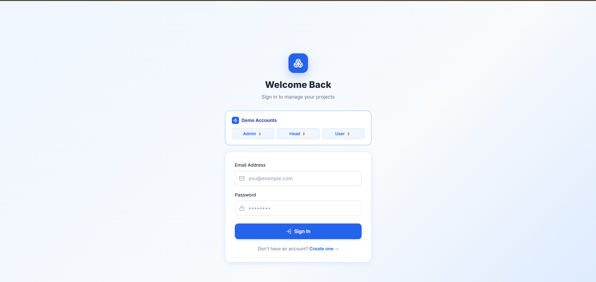

# ProjectHub — Community Project Management Platform

**CodSoft Internship | Level 3 | Task 2**

A full-stack MERN community-driven project management platform with **role-based access**, JWT authentication, Kanban workflows, team collaboration, activity timelines, and an Admin oversight dashboard.

---

## 🚀 Live Demo

| Layer    | URL |
|----------|-----|
| Frontend | [https://codsoft-task2-1.onrender.com](https://codsoft-task2-1.onrender.com) |
| Backend  | [https://codsoft-task2.onrender.com](https://codsoft-task2.onrender.com) |
| Database | MongoDB Atlas |

---

## 🔑 Demo Login Credentials

| Role  | Email                  | Password      | Access                                          |
|-------|------------------------|---------------|-------------------------------------------------|
| Admin | admin@projecthub.com   | adminpassword | Full system overview — all heads, projects, users |
| Head  | rajesh@projecthub.com  | password123   | Create projects, manage team, accept requests   |
| User  | rahul@projecthub.com   | password123   | Browse community projects, request to join      |

> On the login page, click the **Admin ⚡**, **Head ⚡**, or **User ⚡** buttons to auto-fill credentials instantly.

---

## 📸 Screenshots

### Login Page


### Head / Mentor Dashboard


### User Dashboard


### Admin Dashboard


### Project Board (Kanban)


### Create Project


---

## ✨ Features

### 🔐 Authentication & Roles
- JWT-based register and login
- Three distinct roles: **Admin**, **Head (Mentor)**, **User (Community Member)**
- Role is embedded in JWT and enforced on every route (frontend + backend)

### 🎯 Head / Mentor Role
- Create and manage projects
- View **Pending Join Requests** with one-click Accept
- See **My Team Members** with their assigned projects
- Manage Kanban board — move tasks through Todo → In Progress → Done

### 👤 User / Community Role
- Browse **Community Projects** and send join requests to Project Heads
- View joined projects and track tasks on the Kanban board
- Cannot create projects or access admin features

### 🛡️ Admin Role
- Access a dedicated **Admin Dashboard** at `/admin`
- View all Project Heads, their projects, and all team members under them
- No participation rights — read-only oversight

### 📋 Project Management
- Create projects with title, description, and deadline
- Kanban board with 3 columns: **Todo**, **In Progress**, **Done**
- Progress bar per project (% tasks completed)
- Add, edit, and delete tasks with assignee and due date

### 🕐 Activity Timeline
- Automatically logs every task create, update, status change, and delete
- Displayed per project in chronological order

### 🌐 Community System
- All projects are visible to the community
- Users send join requests to Project Heads
- Heads approve requests directly from their dashboard
- Approved members appear on the project's team and in the Head's "My Team" section

---

## 🛠️ Tech Stack

| Layer     | Technology                         |
|-----------|------------------------------------|
| Frontend  | React 18 + Vite                    |
| Styling   | Tailwind CSS v4 + Plain CSS        |
| Routing   | React Router DOM v6                |
| HTTP      | Axios                              |
| Backend   | Node.js + Express.js               |
| Database  | MongoDB Atlas + Mongoose           |
| Auth      | JWT (jsonwebtoken) + bcryptjs      |
| Security  | Helmet + express-rate-limit        |
| Toasts    | react-hot-toast                    |
| Icons     | lucide-react                       |
| Deploy    | Render (Backend + Frontend)        |

---

## 🔌 API Reference

All protected routes require header:
```
Authorization: Bearer <jwt_token>
```

### Auth
| Method | Endpoint           | Auth | Description           |
|--------|--------------------|------|-----------------------|
| POST   | /api/auth/register | ❌   | Register, returns JWT |
| POST   | /api/auth/login    | ❌   | Login, returns JWT    |

### Projects
| Method | Endpoint                      | Auth | Description                              |
|--------|-------------------------------|------|------------------------------------------|
| GET    | /api/projects                 | ✅   | All projects of logged-in user           |
| POST   | /api/projects                 | ✅   | Create project (Head only)               |
| GET    | /api/projects/community       | ✅   | Projects user can request to join        |
| GET    | /api/projects/:id             | ✅   | Single project detail                    |
| DELETE | /api/projects/:id             | ✅   | Delete project (owner only)              |
| POST   | /api/projects/:id/request     | ✅   | Send join request (User only)            |
| POST   | /api/projects/:id/accept      | ✅   | Accept join request (Head only)          |

### Tasks
| Method | Endpoint              | Auth | Description            |
|--------|-----------------------|------|------------------------|
| GET    | /api/tasks/:projectId | ✅   | All tasks in a project |
| POST   | /api/tasks            | ✅   | Create task            |
| PUT    | /api/tasks/:id        | ✅   | Edit task              |
| PATCH  | /api/tasks/:id/status | ✅   | Update task status     |
| DELETE | /api/tasks/:id        | ✅   | Delete task            |

### Activities
| Method | Endpoint               | Auth | Description                    |
|--------|------------------------|------|--------------------------------|
| GET    | /api/activities/:id    | ✅   | Activity timeline for project  |

### Admin
| Method | Endpoint           | Auth | Description                              |
|--------|--------------------|------|------------------------------------------|
| GET    | /api/admin/overview | ✅  | All heads, their projects, and members   |

---

## 🗂️ Folder Structure

```
CODESOFT2/
├── client/                          React + Vite frontend
│   ├── src/
│   │   ├── components/
│   │   │   ├── Navbar.jsx           Role-aware sticky navbar
│   │   │   ├── ProjectCard.jsx      Project card with progress bar
│   │   │   ├── TaskCard.jsx         Task card with status badge & actions
│   │   │   └── ProtectedRoute.jsx   Role-based route protection
│   │   ├── context/
│   │   │   └── AuthContext.jsx      JWT + user + role in localStorage
│   │   ├── pages/
│   │   │   ├── Login.jsx            Multi-role auto-fill login page
│   │   │   ├── Register.jsx         Create account page
│   │   │   ├── Dashboard.jsx        Role-aware dashboard (Head/User views)
│   │   │   ├── CreateProject.jsx    New project form (Head only)
│   │   │   ├── ProjectDetail.jsx    Kanban + requests + activity timeline
│   │   │   └── AdminDashboard.jsx   System-wide overview (Admin only)
│   │   ├── App.jsx                  Routes + role guards + Toaster
│   │   ├── main.jsx                 React entry + Axios base URL config
│   │   └── index.css                CSS design system
│   ├── index.html
│   ├── vite.config.js
│   └── package.json
│
└── server/                          Node.js + Express backend
    ├── models/
    │   ├── User.js                  Schema with role enum (user|head|admin)
    │   ├── Project.js               Schema with members & requests arrays
    │   └── Task.js                  Schema with status enum
    ├── routes/
    │   ├── auth.js                  POST /register, POST /login
    │   ├── projects.js              Full CRUD + community + request/accept
    │   ├── tasks.js                 Task CRUD + status update
    │   ├── activities.js            Activity timeline log
    │   └── admin.js                 Admin-only overview route
    ├── middleware/
    │   └── authMiddleware.js        JWT verification middleware
    ├── seed.js                      Seeds admin + heads + users + projects
    ├── server.js                    Express app + helmet + rate-limit
    ├── render.yaml                  Render Blueprint for deployment
    ├── .env.example                 Environment variable template
    └── package.json
```

---

## ⚙️ Local Setup

### 1. Clone and Install

```bash
git clone https://github.com/Ganesh2006646/codesoft_task2.git
cd codesoft_task2
npm install
npm run install-all
```

### 2. Configure Environment

Create `server/.env`:
```env
PORT=5001
MONGO_URI=mongodb+srv://<user>:<pass>@cluster0.xxxxx.mongodb.net/project-manager?retryWrites=true&w=majority
JWT_SECRET=your_secret_key
DEMO_EMAIL=demo@projecthub.com
DEMO_PASSWORD=demo1234
CLIENT_URL=http://localhost:3001
```

### 3. Seed the Database

```bash
cd server
node seed.js
```

Expected output:
```
✅ Connected to MongoDB
🗑️  Cleared old data
🌱 Database seeded successfully!
─────────────────────────────────
  🛡️ Admin Email  : admin@projecthub.com
  🛡️ Admin Pass   : adminpassword
─────────────────────────────────
  📧 Demo Email   : demo@projecthub.com
  🔑 Demo Password: demo1234
─────────────────────────────────
```

### 4. Run the App

```bash
npm run dev
```

Open → **http://localhost:3001**

---

## 🚢 Render Deployment

This project uses a `render.yaml` Blueprint. To deploy:

1. Push this repository to GitHub.
2. Go to [Render](https://render.com) → **New Blueprint Instance**.
3. Connect your GitHub repo — Render reads `render.yaml` automatically.
4. Set environment variables in the Render backend service:
   - `MONGO_URI` — your MongoDB Atlas connection string
   - `JWT_SECRET` — any secure random string
   - `CLIENT_URL` — your frontend Render URL

> **Build Command:** `cd server && npm install`  
> **Start Command:** `cd server && node server.js`

---

## 🗃️ Database Schemas

### User
| Field     | Type   | Values              |
|-----------|--------|---------------------|
| name      | String | required            |
| email     | String | required, unique    |
| password  | String | bcrypt hashed       |
| role      | String | user \| head \| admin |

### Project
| Field       | Type       | Notes                        |
|-------------|------------|------------------------------|
| title       | String     | required                     |
| description | String     | optional                     |
| deadline    | Date       | optional                     |
| owner       | ObjectId   | ref: User                    |
| members     | ObjectId[] | ref: User                    |
| requests    | ObjectId[] | pending join requests (User) |

### Task
| Field       | Type     | Notes                            |
|-------------|----------|----------------------------------|
| title       | String   | required                         |
| description | String   | optional                         |
| assignee    | String   | optional                         |
| dueDate     | Date     | optional                         |
| status      | String   | Todo / In Progress / Done        |
| project     | ObjectId | ref: Project                     |

---

*CodSoft Internship — Level 3 Task 2 | Built with React + Node.js + MongoDB*
